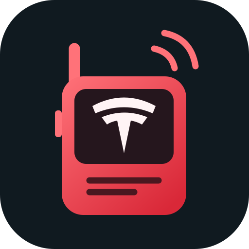
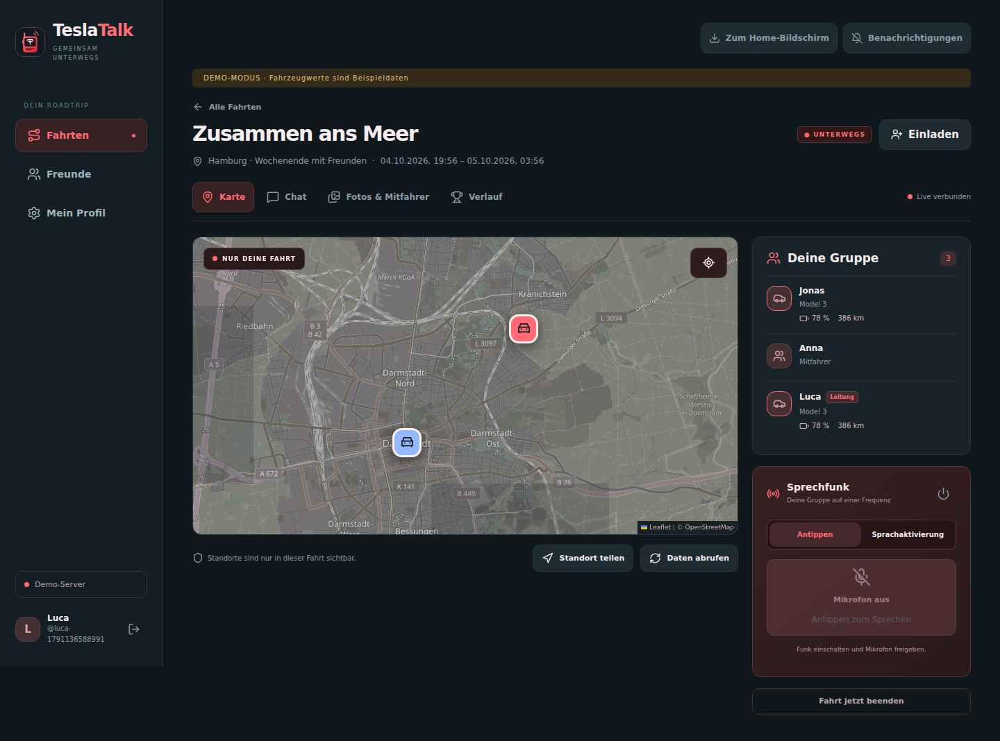

<div align="center">

# TeslaTalk



### Gemeinsam unterwegs. Verbunden bleiben.

<a href="README.en.md"></a>

**Sprachfunk · Fahrten · Live-Karte · Freunde · Installierbare PWA**


Deine Gruppe. Deine Fahrt. Dein Server.

</div>

---

TeslaTalk verbindet Freunde, die gemeinsam mit ihren Teslas unterwegs sind. Eine Fahrt bündelt Sprachfunk, Chat und eine Karte der Teilnehmer. Die Oberfläche ist für den Tesla-Browser gedacht und funktioniert auch auf Handy, Tablet und Computer. Der Server läuft selbst gehostet in Docker. Auf dem Handy lässt sich TeslaTalk direkt auf den **Home-Bildschirm** legen – mit eigenem Icon und **Web-Push-Benachrichtigungen**.

> **0.1 Preview:** Weboberfläche, API und Demo sind implementiert. Für echte Fahrzeuge braucht deine Installation eine konfigurierte Tesla-Fleet-Anwendung und einen erreichbaren LiveKit-Server. Tests im echten Tesla sowie die Push-Zustellung auf physischen Handys stehen noch aus.



*Die Oberfläche im Demo-Modus. Angezeigte Fahrzeugwerte sind Beispieldaten.*

## Das steckt in Version 0.1

| Bereich | Implementierter Umfang |
| --- | --- |
| Tesla-Anmeldung | Offizielle OAuth-Weiterleitung; bei Erstanmeldung eindeutigen Benutzernamen wählen; TeslaTalk nimmt keine Tesla-Passwörter entgegen |
| Fahrzeuge | Fahrzeuge des Kontos abrufen, Fahrzeug auswählen und Favoriten festlegen |
| Freunde | Anfragen, Annahme und Einladungen über Benutzername, Kennzeichen oder vorhandene E-Mail-Adresse |
| Fahrten | Name, Ziel, Beginn und Ende; Beitritt per PIN oder Einladung |
| Karte | Personenmarker mit Tesla-Profilbild und Browser-Standort, separate Fahrzeugmarker; auch Mitfahrer können ihren Standort teilen |
| Fahrzeugnavigation | Navigationsziel, Reststrecke, Restzeit und Akku bei Ankunft aus dem eigenen Tesla abrufen; Empfehlungen nach Akku/Reichweite, Auswahl des Planungsautos, automatische Anzeige seiner Route und zustimmungsgebundene Zielübernahme; genaue Linie über Telemetrie |
| Komfortsteuerung | Fahrtleiter steuert freigegebene Fahrerfahrzeuge gesammelt: Frunk, Heckklappe, Fenster und Klima; separate Zustimmung und signierte Tesla-Befehlsanbindung erforderlich |
| Sprachfunk | Mehrere Sprecher gleichzeitig; Mikrofon per Antippen an/aus und Sprachaktivierung; selbst gehosteter LiveKit-Server |
| Chat | Persistenter Fahrt-Chat mit Echtzeit-Updates, auch in der mobilen PWA |
| PWA & Push | Installation auf dem Home-Bildschirm; dauerhaft gespeicherte Benachrichtigungsauswahl im persönlichen Profil |
| Mitfahrer | Selbstregistrierung per QR-Link mit eigenem Namen und selbst gewähltem sechsstelligen PIN; auf den Fahrtzeitraum begrenzt |
| Historie | Vollständige Speicherung der erfassten Daten und Export; Rankings für Verbrauch, Zeit und Durchschnittstempo |
| Administration | Separater OIDC-Zugang; Benutzerliste mit Tesla-Mail, Benutzername, Kennzeichen, Tesla-Profilbild und zuletzt erfasstem Login |
| API | Persönliche, widerrufbare API-Schlüssel; vollständige Endpunktübersicht unter `/api-docs` mit Suche, Schemas und Kopierbutton für den gesamten LLM-Kontext |
| Teilen | Separater, widerrufbarer Leselink zur Fahrtübersicht nach Fahrtende; Albumzugriff folgt mit Immich |

## Roadmap

### Gemeinsame Routen und Ladestopps

- Die vollständige Ladehaltefolge des ausgewählten Planungsfahrzeugs als gemeinsame Zwischenstopps übertragen; bislang sind nur Zielbefehle implementiert.
- Unterschiedliche Akkustände berücksichtigen, damit die Gruppe an denselben Superchargern laden kann.
- **Live-Belegung an Ladestopps:** anzeigen, wie viele Ladepunkte an den geplanten Stopps frei oder belegt sind, mit Zeitpunkt der letzten Aktualisierung. Voraussetzung sind verfügbare Live-Daten des jeweiligen Betreibers.
- Auf nötige Änderungen hinweisen und danach die gemeinsame Route automatisch bei allen anpassen.
- Tesla-Schnittstellen für Routenübernahme, Zwischenstopps und Musiksteuerung am echten Fahrzeug prüfen.

### Fotoalben mit Immich (geplant)

**Noch nicht implementiert:** TeslaTalk erzeugt bisher nur den geplanten Albumnamen. Es gibt keine Verbindung zur Immich-API, keine Speicherung von Immich-Zugangsdaten und keine Foto-Uploads. Mitfahrer-Zugang und öffentliche Fahrtübersicht funktionieren unabhängig davon. Der [Projektprüfbericht](docs/PROJECT-CHECK.de.md) beschreibt den aktuellen Stand.

- Die Immich-Instanz des Fahrtleiters verwenden.
- Automatisch ein Album mit **Fahrtname und Zeitraum** anlegen.
- Neben dem Fotobereich einen QR-Code für benannte Mitfahrer anzeigen.
- Mitfahrer scannen den QR-Code und registrieren sich selbst mit **eigenem Namen und selbst gewähltem sechsstelligen PIN**; ein Tesla-Konto ist dafür nicht erforderlich. Für spätere Anmeldungen verwenden sie denselben Namen/PIN. Der Fahrtleiter muss keine Zugangsdaten vorab anlegen.
- Zugang und Bild-Uploads auf den eingegebenen Fahrtzeitraum begrenzen. **Nach Fahrtende sind Uploads gesperrt.**
- Nach der Fahrt einen separaten, widerrufbaren **Leselink** erstellen, über den auch externe Personen die Fahrtübersicht und das Album anschauen können.
- Öffentliche Freigaben erhalten keinen Zugang zu privaten Chats, Tesla-Konten oder Live-Standorten.

### Mobile Weiterentwicklung der PWA

TeslaTalk wird zunächst als Website umgesetzt, die sich auf dem Home-Bildschirm installieren lässt. Du öffnest die Adresse deines eigenen Servers; eine App-Store-App ist dafür nicht nötig.

- Die mobile Bedienung und Benachrichtigungen auf echten Geräten weiter prüfen.
- Gemeinsame Ladestopps und Immich in die PWA integrieren.
- Einen Serverwechsel direkt in der Oberfläche später erleichtern.

#### Idee: „Ich muss aufs Klo“ 🚻

Ein Knopf in der App meldet dem **Fahrtleiter**, welcher Teilnehmer eine Toilettenpause braucht. Der Fahrtleiter kann auf der Karte einen passenden **Rastplatz** suchen und auswählen. Dieser wird als gemeinsamer Zwischenstopp übernommen; anschließend **aktualisiert TeslaTalk die Route für alle Teilnehmer**.

Die Meldung ist ein Pausenwunsch. Die Entscheidung über den Rastplatz bleibt beim Fahrtleiter. Mehrere Wünsche können später zu einem gemeinsamen Pausenstopp zusammengefasst werden.

## Technische Richtung

| Komponente | Aufgabe |
| --- | --- |
| React / TypeScript | Responsive Oberfläche für Tesla-Browser und Mobilgeräte |
| FastAPI | Anmeldung, Fahrten, Freunde, Chat, Fahrzeugdaten und API |
| SQLite | Persistente Speicherung auf einem Docker-Volume |
| WebSocket | Chat, Präsenz und Standortaktualisierungen innerhalb einer Fahrt |
| LiveKit | Selbst gehosteter Sprachfunk mit gleichzeitigen Sprechern |
| Tesla Fleet API | Offizielle Konto- und Fahrzeuganbindung |
| OIDC | Separater Administratorzugang |

## Ausprobieren

Voraussetzungen: Git, Python 3, OpenSSL und Docker Compose v2.

```bash
git clone https://github.com/Baodor/TeslaTalk.git
cd TeslaTalk
python3 scripts/configure.py --demo
docker compose up -d --build
```

Öffne **http://localhost:8780**. Der ausdrücklich aktivierte Demo-Modus erzeugt Beispieldaten und benötigt kein Tesla-Konto. Für eine echte Installation bleibt `DEMO_MODE=false`.

Für HTTPS auf einer neuen Installation:

```bash
python3 scripts/configure.py \
  --url https://talk.example.com \
  --voice-url wss://voice.example.com \
  --email du@example.com
docker compose -f compose.yaml -f deploy/compose.https.yaml up -d --build
```

Das Bootstrap-Skript überschreibt keine bestehende `.env`. Bei einer vorhandenen Installation passt du die Adressen direkt an und behältst die bestehenden Schlüssel.

### Mit vorhandenem Traefik starten

Die vollständige [compose.traefik.yaml](compose.traefik.yaml) enthält TeslaTalk, den LiveKit-Sprachserver, den Datenspeicher und die Router für dein externes `proxy`-Netzwerk. Für `teslatalk.glockb.de` gibt es eine **[deutsche Schritt-für-Schritt-Startanleitung](docs/START.de.md)** mit Schlüsselerzeugung, DNS, Ports, Tesla-Anmeldung, OIDC und PWA-Benachrichtigungen. Nach der Einrichtung startest du mit:

```bash
docker compose -f compose.traefik.yaml up -d --build
```

Traefik spricht TeslaTalk intern auf **8780** und LiveKit auf **7880** an. Für Audiodaten müssen zusätzlich **7881/TCP** und **7882/UDP** erreichbar sein. Die bisherigen Overlays unter `deploy/` bleiben für Kombinationen mit `compose.yaml` verfügbar.

[Einrichtung, Tesla Fleet API, OIDC und Backup](docs/SETUP.md) · [API-Dokumentation](docs/API.md)

### Navigation und Planungsfahrzeug

Bei der ersten Tesla-Anmeldung fordert die App einen eindeutigen **Benutzernamen** an: 3–30 Zeichen aus Buchstaben, Ziffern, `_` und `-`. Groß-/Kleinschreibung unterscheidet keine Namen; bestehende selbst gewählte Benutzernamen bleiben erhalten. Ältere automatisch erzeugte Tesla-Namen werden beim Update zur Auswahl aufgefordert.

Unter **Fotos & Mitfahrer** zeigt der Fahrtleiter den QR-Link. Während der aktiven Fahrt können Mitfahrer darüber ihren Namen und einen eigenen sechsstelligen PIN festlegen und direkt beitreten. Name/PIN funktionieren später zur erneuten Anmeldung; gleiche Namen innerhalb einer Fahrt werden nicht überschrieben. Registrierte Mitfahrer erscheinen sofort in der Gruppe.

Die **Administration → Alle Benutzer** zeigt Tesla-Mail, Benutzername, Kennzeichen, Tesla-Profilbild und letzten erfassten Login. Diese Daten sind nur mit separater Admin-Sitzung abrufbar. Loginzeiten werden ab diesem Update erfasst; ältere unbekannte Zeitpunkte bleiben leer. Fehlende Tesla-Bilder verwenden Initialen.

**Benutzer löschen** verlangt im Adminmenü die genaue Eingabe des Benutzernamens. Es entfernt dauerhaft das Konto, dessen Zugänge, Fahrzeuge und eigene Daten sowie alle von ihm geleiteten Fahrten einschließlich ihrer Gruppendaten und verwaisten QR-Konten. Die Bestätigung nennt diesen Umfang ausdrücklich. Fremde Fahrten bleiben bestehen.

Mitfahrer können unter **Mein Profil → Tesla-Profil für Mitfahrer** ihr Tesla-Konto ausschließlich für Profilbild und Mailadresse verknüpfen. Ihr QR-Name/PIN, die Mitfahrerrolle und das Zugangsende bleiben erhalten; kein Auto wird abgerufen oder in Akku, Reichweite, Planung oder Fahrzeugsteuerung einbezogen. Die Verknüpfung kann wieder entfernt werden.

Das Logo führt von allen Seiten direkt zur Startseite. Für Desktop-Browser stehen zusätzlich ein mehrteiliges `favicon.ico` sowie 32-/64-Pixel-PNGs bereit. OSM-Kartenanfragen senden nur den Ursprung der Website als erforderlichen Referrer, keine privaten Fahrtpfade. Bei blockierten Kacheln erscheint eine Meldung mit einem Knopf zum erneuten Laden.

In der aktiven Fahrt stehen **geringste gemeldete Reichweite** und **niedrigster Akkustand** getrennt oben in der Routenübersicht. Empfehlungen verwenden nur Werte der letzten fünf Minuten; fehlende Werte werden nicht als null Kilometer/Prozent behandelt. Der Fahrtleiter sieht alle Fahrerfahrzeuge und wählt eines für die erste Planung. **Vor dieser Auswahl wird keine Fahrerroute zur Gruppenroute.**

Das ausgewählte Auto erhält eine Zieladresse und berechnet seine Navigation. Seine aktuelle Antwort/Telemetrie wird danach automatisch als Gruppenroute angezeigt. Andere Fahrer können die automatische Zielübernahme in ihrem eigenen Auto für diese Fahrt erlauben und jederzeit beenden. Abweichender Straßenverlauf oder eine gemeldete nicht fahrbare Route wird dem Fahrtleiter angezeigt; er kann die aktuelle Route dieses Autos als neuen Ausgangspunkt übernehmen. Die Route bleibt innerhalb der berechtigten Gruppe; öffentliche Leselinks enthalten keine Navigation.

**Noch keine identischen Ladestopps:** Der implementierte Tesla-Befehl `navigation_request` überträgt eine Zieladresse. Jeder Tesla berechnet seinen eigenen Weg und seine eigenen Ladehalte. Der Straßenverlauf kommt ausschließlich über eine angebundene Fleet-Telemetry-Integration (`RouteLine`, Base64 + Polyline6). Die genaue Ladehaltefolge wird damit nicht automatisch exportiert oder an andere Autos übertragen. Der gewünschte gemeinsame Ladeablauf ist deshalb noch nicht vollständig umgesetzt und wird in der Oberfläche nicht als bestätigt dargestellt. Tesla dokumentiert einen separaten Zwischenstopp-Befehl; eine öffentlich dokumentierte Leseschnittstelle für die in der Tesla-App sichtbare Ladehaltefolge fehlt. Der [Entwurf für Ladepläne und ABRP](docs/CHARGING-PLANS.de.md) beschreibt eine zusätzliche Planungsquelle und die noch nötige Fahrzeugprüfung.

Unter **Mein Profil → Route aus deinem Auto** liest du Navigation weiterhin privat. Echte Zielbefehle erfordern `TESLA_NAVIGATION_COMMANDS=true`, Freigabe von `vehicle_cmds` in der Tesla-Anwendung und erneutes Verbinden jedes Tesla-Kontos. Diese Routenfreigabe erlaubt ausschließlich Navigationsziele und kein Aufwecken. Die [Routenanleitung](docs/ROUTES.de.md) erklärt Datenquellen, Rechte und Grenzen.

Der Fahrtleiter öffnet den nur für ihn sichtbaren Tab **Fahrzeugsteuerung** neben **Verlauf** für getrennte Knöpfe **Frunk öffnen**, **Heckklappe betätigen**, **Fenster lüften/schließen** und **Klima an/aus**. Jeder Fahrer erlaubt die Komfortsteuerung separat für sein aktuelles Auto und diese Fahrt; andere Fahrer finden nur die eigene Freigabe auf der Karte. Der Bestätigungsdialog nennt die betroffenen Autos, anschließend werden Einzelergebnisse angezeigt. Ergebnisse bleiben beim Tabwechsel erhalten. Türen werden nicht verriegelt/entriegelt, der Frunk wird von Hand geschlossen. Echte Steuerung benötigt `TESLA_GROUP_CONTROLS=true`, einen offiziellen signierten Command-Proxy, `vehicle_cmds` und den virtuellen Fahrzeugschlüssel. Die [Einrichtungsanleitung](docs/VEHICLE-CONTROLS.de.md) enthält das interne Docker-Overlay und die zusätzliche Aktivierung von Navigationsbefehlen; zusätzliche öffentliche Ports sind dafür nicht nötig.

**ABRP-Linkimport noch offen:** Ein gespeicherter Teilen-Link wird bislang nicht als Route abgerufen. Für den tatsächlich vorhandenen Plan samt Ladestopps ist ein verifizierter Abrufvertrag nötig; die dokumentierte Iternio-Planungsschnittstelle braucht API-Zugang und eine Neuberechnung wäre ein anderer Plan. Eine reine Linkablage wird nicht als erfolgreicher Import angezeigt. Details im [ABRP-Entwurf](docs/CHARGING-PLANS.de.md).

Unter **Mein Profil → Persönliche API-Schlüssel** führt der Link zur Seite **`/api-docs`**. Der Kopierbutton nimmt alle Endpunkte, Zugriffsregeln, Beispiele und vollständigen Schemas mit, unabhängig von Suchfiltern. Tatsächliche Zugangsdaten und private Fahrzeugdaten sind nicht Bestandteil des Kopiertexts. Die [Testcheckliste](docs/TEST-CHECKLIST.de.md) beschreibt die Prüfung am eigenen Server und Auto.

## Ports für den Sprachfunk

| Port | Aufgabe | Erreichbarkeit |
| --- | --- | --- |
| **443/TCP** | Webseite und LiveKit-Signalisierung über HTTPS/WebSocket | Öffentlich über den vorhandenen HTTPS-Proxy |
| **7882/UDP** | Direkte WebRTC-Audiodaten | Öffentlich bis zum LiveKit-Container weiterleiten |
| **7881/TCP** | Direkter WebRTC-Ausweichweg, wenn UDP nicht funktioniert | Öffentlich bis zum LiveKit-Container weiterleiten |
| 7880/TCP | LiveKit HTTP/API intern | Nur für TeslaTalk und den HTTPS-Proxy; nicht direkt öffentlich freigeben |
| 8780/TCP | TeslaTalk HTTP intern | Traefik leitet die Webseite hierhin weiter |

**CGNAT mit VPS und WireGuard:** Auf dem öffentlichen VPS **7882/UDP und 7881/TCP** auf dieselben Ports der WireGuard-IP des Heimservers weiterleiten und im Forwarding erlauben. Auch der Rückweg muss durch den Tunnel laufen. Ein funktionierender HTTPS-Zugang oder ein ausgehender VPN-Tunnel reicht dafür nicht.

In `.env` `LIVEKIT_PUBLIC_IP` auf die **öffentliche IPv4 des VPS** setzen. Danach `python3 scripts/configure_voice.py` ausführen und LiveKit neu erstellen. Der normale Cloudflare-HTTPS-Proxy ersetzt die direkte Weiterleitung der Audio-Ports nicht. Die Konfiguration verwendet UDP-Mux auf 7882; ein zusätzlicher UDP-Bereich 50000–60000 ist dafür nicht erforderlich.

Die [CGNAT-Anleitung](docs/CGNAT.de.md) enthält Diagnose, die dauerhafte VPS-Weiterleitung und einen Sprachtest mit Mobilfunk. Die [Startanleitung](docs/START.de.md) beschreibt die vollständige Docker-/Traefik-Einrichtung.

## Auf den Home-Bildschirm

**iPhone/iPad:** In Safari öffnen → Teilen → **Zum Home-Bildschirm**. Anschließend über das neue Symbol starten und unter **Mein Profil → Benachrichtigungen & Web-App** aktivieren. Web-Push setzt hier iOS/iPadOS 16.4 oder neuer voraus. [Apple/WebKit erklärt die Unterstützung](https://webkit.org/blog/13878/web-push-for-web-apps-on-ios-and-ipados/).

**Android/Chrome:** Installationsknopf oder Browser-Menü nutzen und Benachrichtigungen ausdrücklich erlauben. Dein Icon kombiniert ein **Tesla-T mit einem Walkie-Talkie**. Installation und Push benötigen HTTPS; der lokale Demo-Aufruf über `localhost` ist die Entwicklungs-Ausnahme.

Benachrichtigungen verraten keine Chattexte, Kennzeichen oder Standorte. Mitfahrer erhalten Push nur während ihres gültigen Zugangs. Die Offline-Seite hält dich über Verbindungsprobleme informiert; Sprachfunk und aktuelle Daten benötigen Internet. Durchgehend laufender Sprachfunk im Hintergrund hängt vom Gerät und Browser ab.

## Was schon geprüft ist

- **Backend-Tests:** Rechte innerhalb einer Fahrt, PINs, Zeitgrenzen, private Freigaben, OAuth-Zustand, API-Schlüssel, Ranglisten, Push-Abonnements, OIDC-Gruppen und Tesla-Registrierung.
- **Browser-Tests:** Echtzeit-Chat mit zwei Fahrern, Mitfahrerzugang und Fahrtende, mobile Darstellung, Service Worker, Offline-Cache, Push-Einwilligung, Mikrofonfreigabe und Profilbilder auf der Karte.
- **TypeScript und Produktionsbuild** erfolgreich. GitHub Actions prüft zusätzlich zwei gleichzeitige Mikrofone mit Antippbedienung sowie Build und Start des Produktionscontainers.

Push-Versand wird im Backend mit simulierten Push-Diensten geprüft; der Browser-Test prüft die Einwilligung mit einem simulierten Abonnement. Eine echte Tesla-Anmeldung und echte Push-Zustellung auf iOS/Android wurden hier noch nicht bestätigt.

## Bekannte Grenzen

- Fahrzeugabfragen laufen standardmäßig alle **120 Sekunden** für alle Fahrerfahrzeuge einer aktiven Fahrt, solange mindestens ein Teilnehmer die Gruppe geöffnet hat. Die Browser der Fahrzeugbesitzer dürfen geschlossen sein. Ohne verbundenen Teilnehmer erfolgen keine neuen Gruppenabfragen. Alle Teilnehmer sehen die bekannten Fahrzeugpositionen auf der gemeinsamen Karte; fehlende GPS-Daten werden angezeigt. Persönliche Browser-Standorte werden bei aktiver Freigabe höchstens alle zehn Sekunden übertragen. Das ist noch kein Fleet-Telemetry-Streaming und kann Tesla-API-Kosten verursachen.
- Verbrauchswerte erscheinen nur mit gemessenen Energie- und Kilometerzählern aus einer passenden Integration. V1 leitet keinen Verbrauch aus dem Akkustand ab.
- Ladeplanung, Übertragung von Routen an andere Autos, Musiksteuerung und Immich sind **Roadmap-Funktionen**. Routenabruf, Planungsfahrzeugauswahl und automatische Gruppenanzeige sind implementiert; Ziele werden mit Zustimmung übernommen, identische Ladehalte noch nicht. Der QR-Zugang ist bereits nutzbar; Foto-Uploads sind noch nicht angebunden.
- Ob Mikrofon und Browser während der Fahrt verfügbar sind, muss für Fahrzeug, Region und Firmware geprüft werden. Zielbefehle brauchen eine ausdrücklich aktivierte Tesla-Befehlsanbindung; sonst bleiben Fahrzeugzugriffe lesend.
- Die Administration bietet eine Statusübersicht und die Benutzerliste mit Tesla-Mail, Benutzername, Kennzeichen, Profilbild und zuletzt erfasstem Login. Serverkonfiguration erfolgt über Umgebungsvariablen.
- Ein Server nutzt einen FastAPI-Prozess mit SQLite. Mehrere Instanzen und verteilte Skalierung folgen später.

## Lizenz

TeslaTalk steht unter der [GNU Affero General Public License v3.0](LICENSE). Bei veränderten Versionen, die als Netzwerkdienst angeboten werden, ist Nutzern der entsprechende Quellcode bereitzustellen.

TeslaTalk ist nicht mit Tesla, Inc. verbunden und wird nicht von Tesla unterstützt. Tesla und die Fahrzeugnamen sind Marken ihrer jeweiligen Inhaber.
